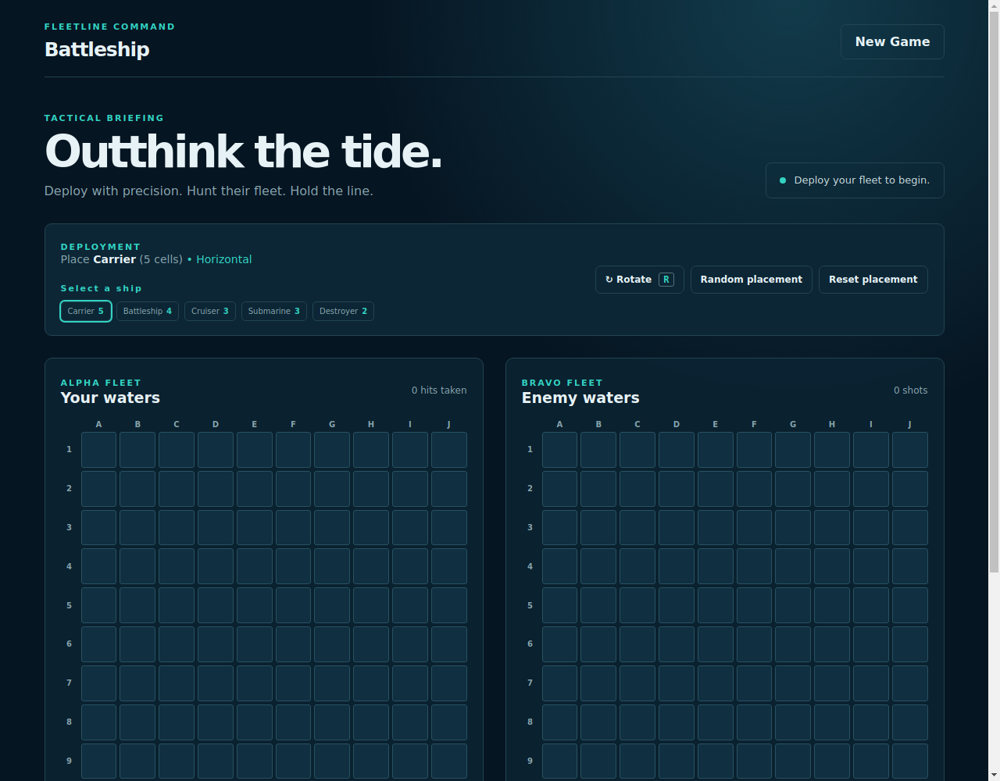

# Fleetline Battleship



Fleetline is a polished, accessible Battleship single-page application built with
React, TypeScript, Vite, and plain CSS. It runs entirely in the browser: no
backend, authentication, database, API key, or external service is required.

## Features

- 10×10 boards with the standard Carrier (5), Battleship (4), Cruiser (3),
  Submarine (3), and Destroyer (2) fleet.
- Manual horizontal/vertical placement with overlap and boundary validation.
- Hover previews, keyboard `R` rotation, fleet selection, random placement,
  and reset placement.
- Deliberate AI opponent with hunt and target modes.
- Clear hit, miss, sunk, current-turn, and winner states.
- Responsive desktop layout that stacks cleanly on narrow screens.
- Keyboard-friendly, labelled buttons, arrow-key board navigation, visible
  coordinates, semantic grid rows, polite live status updates, and a legend.
- Deterministic, injectable random number generation in pure game logic.

## Quick start

Requires Node.js 18 or newer.

```bash
npm install
npm run dev
```

Open the local URL printed by Vite. The production build is static and can be
served from any CDN.

## Scripts

| Command                | Purpose                                     |
| ---------------------- | ------------------------------------------- |
| `npm run dev`          | Start the Vite development server           |
| `npm run build`        | Type-check and create the production bundle |
| `npm run lint`         | Run ESLint                                  |
| `npm run typecheck`    | Run TypeScript without emitting             |
| `npm test`             | Run the non-watch Vitest suite              |
| `npm run format`       | Format the repository with Prettier         |
| `npm run format:check` | Verify repository formatting                |

## Project structure

```text
src/
├── game/                         # Pure, UI-free game rules
│   ├── ai.ts                     # Hunt/target opponent strategy
│   ├── board.ts                  # Board creation and placement
│   ├── combat.ts                 # Firing, hit, sunk, win rules
│   ├── fleet.ts                  # Fleet definitions
│   └── types.ts                  # Shared domain types
├── hooks/useBattleship.ts        # Reducer and delayed-turn orchestration
├── components/                   # Presentation and accessible controls
│   ├── Board.tsx / Cell.tsx
│   ├── BoardPanel.tsx
│   ├── FleetStatus.tsx
│   ├── PlacementPanel.tsx
│   └── Game.tsx
└── styles.css                    # CSS-variable design system
```

## Architecture and state machine

Game rules are kept pure under `src/game/`; they do not import React, access
the DOM, or call `Math.random`. An RNG function is passed to random placement
and AI decisions, which makes simulations deterministic. React presentation
lives under `src/components/`, while `useBattleship` owns a reducer and a
short-lived AI timer.

```text
placement ── Start mission ──> playerTurn
    │                              │
    │                              └─ Fire ──> aiTurn
    │                                             │
    │                        AI timer resolves ───┘
    │
    └─ New Game <──────── gameOver <── either fleet sunk
```

Every action is phase-gated. The AI timeout is cancelled on phase changes,
unmount, and New Game; the reducer also ignores an AI action outside `aiTurn`.
The reducer carries a deterministic seed counter rather than reading the
clock, so React StrictMode cannot produce divergent AI results.

## AI strategy

1. **Hunt:** untried cells are filtered through a checkerboard parity mask.
   The mask is based on the minimum remaining ship length, tightening as
   smaller ships remain.
2. **Target:** every hit adds orthogonal neighbors to a queue. The AI never
   selects a coordinate in its fired set.
3. **Line extension:** once two hits are collinear, cells continuing that axis
   are preferred in both directions.
4. **Sunk cleanup:** when a ship sinks, queued cells belonging to that ship and
   its historical hits are purged, returning the opponent to a clean hunt.

## Testing approach

Vitest runs in jsdom with Testing Library for UI behavior. Focused tests cover
empty boards, both placement orientations, all invalid placement boundaries,
random legal fleets across many seeds, combat outcomes, repeated shots, win
conditions, AI exhaustion and targeting behavior, parity, sunk cleanup, and
the full random-deploy → start → fire → AI-turn → reset flow with fake timers.

## Accessibility

Both boards use labelled `role="grid"` containers with `role="row"` wrappers
and focusable gridcell buttons. A–J and 1–10 coordinates are visible, cells
have descriptive labels such as “C4, sunk Cruiser”, arrows move through the
whole board including already-fired cells, and status/winner text uses polite
live regions. Miss, hit, and sunk states use different colors, symbols, and
border treatments rather than color alone.

## Deployment

### Vercel

1. Push the repository to your Git provider.
2. In Vercel, choose **Add New → Project** and import the repository.
3. Keep the framework preset as Vite.
4. Set **Build Command** to `npm run build`.
5. Set **Output Directory** to `dist`.
6. Deploy. `vercel.json` includes the SPA rewrite so direct routes resolve to
   `index.html`. No environment variables are needed.

### Netlify

1. In Netlify, choose **Add new site → Import an existing project**.
2. Select the repository and choose the Vite preset if offered.
3. Set **Build command** to `npm run build`.
4. Set **Publish directory** to `dist`.
5. Deploy. `netlify.toml` provides the SPA fallback redirect for direct routes.
